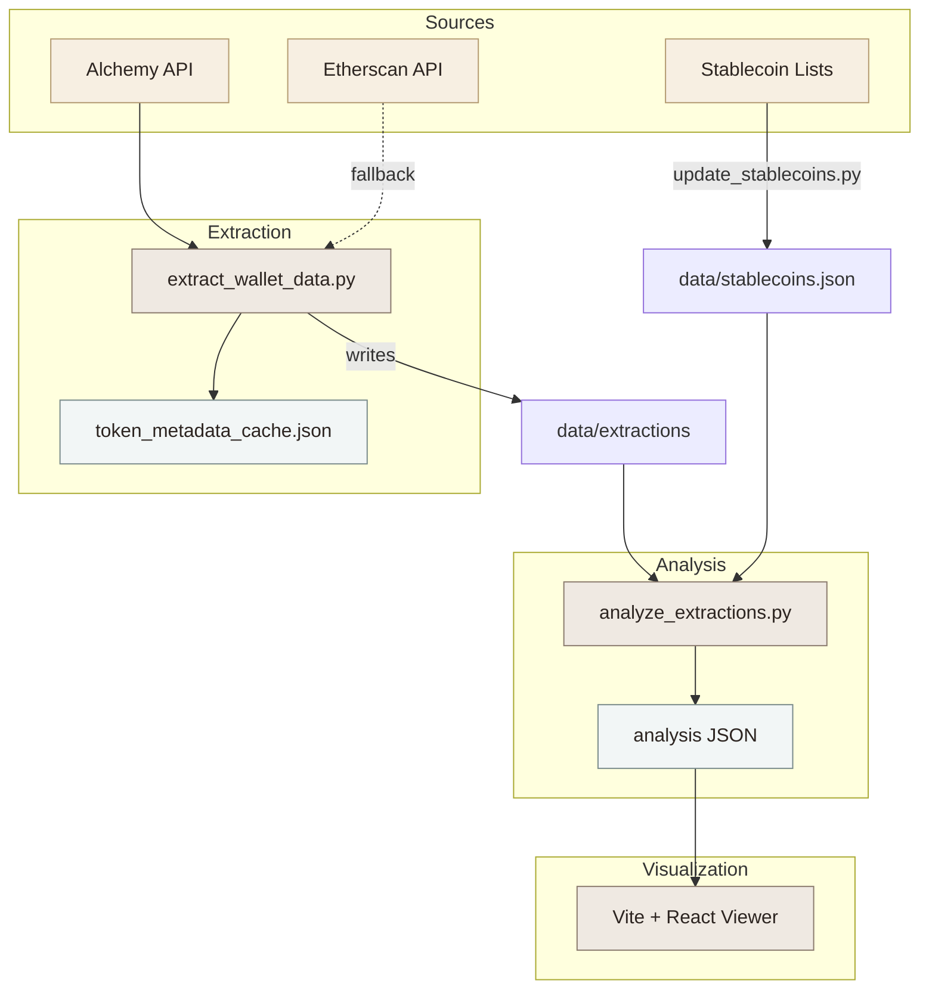
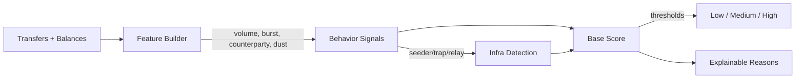
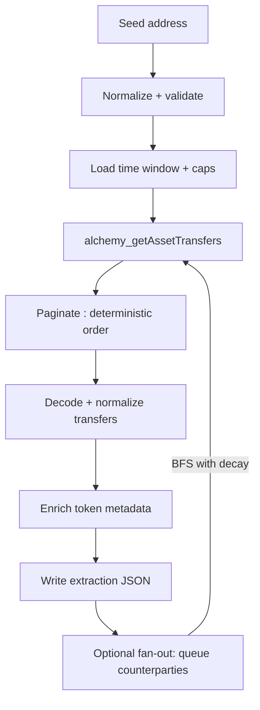

# Probo

**Probo helps communities build trust in each other — without banks, IDs, or middlemen.**

Trust is earned through actions, not documents. Probo surfaces trust signals from on-chain behavior so people in peer-to-peer economies can make their own calls.

African communities have always relied on trust networks — Probo makes those signals portable in a digital world.

## Why trust signals

Informal economies are real economies. When there is no contract, no chargeback, and no institution to lean on, behavior is the signal. Probo summarizes patterns from payment history so trust can travel without identity checks.

## What it does

- Extracts transfers, token balances, and fan-out context for an address.
- Summarizes behavior into a Low/Medium/High trust band with plain reasons.
- Highlights behavioral patterns (seeder/trap/relay-style activity) without identity assumptions.
- Keeps local caches for token metadata and curated lists.
- Provides a viewer to explore activity, counterparties, and patterns.

## Canonical example

“How can I trust your address without trusting you?”

Probo answers: “By showing how this address has behaved in the past — across real transactions.”

## Website
- http://probo.co.za 

## Quick start

Create a `.env` file at repo root:

```bash
ALCHEMY_API_KEY=...
ETHERSCAN_API_KEY=... # optional fallback and enrichment
```

Extract data for test addresses:

```bash
python3 scripts/extract_wallet_data.py --addresses-file test_address.txt --days 120
```

Analyze extractions:

```bash
python3 scripts/analyze_extractions.py
```

Run the viewer:

```bash
cd viewer
npm install
npm run dev
```

## Architecture



## Analysis flow (high level)



## Makefile shortcuts

```bash
make blocknumber
make blocknumber-json
make extract-wallet-data
make extract-wallet-data-90d
make extract-120
make extract-with-fanout
make analyze-extractions
```

## Data layout

- `data/extractions/*.json`: raw extracted activity per address
- `data/analysis/*.json`: analysis output with trust band + reasons
- `data/token_metadata_cache.json`: cached token metadata
- `data/stablecoins.json`: curated stablecoin list

## Extraction details

Probo uses Alchemy as the primary data source via `alchemy_getAssetTransfers` for all categories:

- `external`, `internal`, `erc20`, `erc721`, `erc1155`
- pagination with deterministic ordering
- optional fan-out (BFS) with decay to avoid explosions
- cap at 1000 transfers per address by default

Optional Etherscan fallback is used for:

- all-time transfer count
- earliest/latest transaction bounds
- token metadata when Alchemy is incomplete

## Extraction flow (per address)



Each address is processed with a bounded time window and transfer cap, then paginated deterministically to ensure repeatable pulls. Transfers are normalized, enriched with token metadata, and written to an extraction JSON. When fan-out is enabled, counterparties are queued and fetched with a decay rule to keep the graph expansion controlled.

## Analysis output

Each analysis JSON includes:

- `label`: Low / Medium / High trust band
- `score`: numeric trust signal (behavior-based)
- `reasons`: short, explainable signals
- `features`: quantified metrics used by the scoring
- `infra`: optional infra behavior detection summary

## Viewer

The viewer loads a JSON file, stores it in IndexedDB, and lets you explore:

- transfer activity breakdowns
- per-address summaries
- force graph of connected addresses/tokens
- directional edges for transfer flow

## Notes

- No tests are set up yet; if you add tests, use `pytest` under `tests/`.
- Secrets are loaded from `.env` (do not hardcode).
- External intelligence sources are optional and pluggable; keep curated lists in `data/` and wire them into analysis as overlays.

## Roadmap

- [x] Alchemy-based extraction pipeline (asset transfers + balances).
- [x] Deterministic ordering + pagination with caps.
- [x] Fan-out graph expansion with decay.
- [x] Token metadata caching (Alchemy + Etherscan fallback).
- [x] Analysis engine with explainable reasons + rating.
- [x] Infra behavior detection (seeder/trap/relay signals).
- [x] Viewer app with force graph + upload + IndexedDB.
- [x] Stablecoin list ingestion.
- [ ] Address label sources (beyond curated lists).
- [ ] Test suite with pytest (unit + fixtures).
- [ ] CLI/API server for analysis at scale.

## License

TBD
